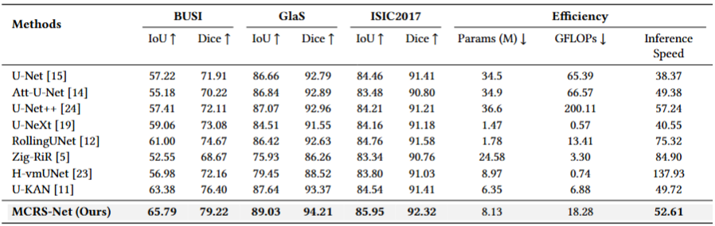

# SAL-Net

## 0. Abstract

The Kolmogorov-Arnold Network (KAN) has attracted wide-spread attention in the field of medical image segmentation due to its powerful nonlinear modeling capabilities. However, existing KAN-based methods mostly use it as a backbone network, which can easily lead to information loss during downsampling and global context modeling. Furthermore, the skip connections in these methods often use simple addition operations to fuse encoder outputs, which makes it difficult to fully integrate contextual information. To address this issue, we propose SAL-Net: We introduce a state-space interactive attention mechanism into the KAN backbone network to achieve efficient global context modeling. We also design a large-kernel selective attention module to adaptively fuse spatial features at different scales, thereby learning the optimal receptive field and improving the recognition of diverse objects. Comprehensive experimental results on the BUSI, GlaS, and ISIC2017 datasets demonstrate that SAL-Net consistently outperforms existing methods, achieving superior segmentation accuracy and robustness. The code is publicly available at https://github.com/Anonymous2026sucess/SAL-Net.

## 1. Overview

<div align="center">

</div>


## 2. Main Environments

You can follow the [U-KAN](https://github.com/Zhaoyi-Yan/U-KAN) and [UltraLight-VM-UNet](https://github.com/wurenkai/UltraLight-VM-UNet) installation instructions, or follow the steps below (Python 3.8):

```
conda create -n SAL-Net python=3.8
conda activate SAL-Net
pip install torch==1.13.0 torchvision==0.14.0 torchaudio==0.13.0 
pip install packaging
pip install timm==0.4.12
pip install pytest chardet yacs termcolor
pip install submitit tensorboardX
pip install triton==2.0.0
pip install causal_conv1d==1.0.0  
pip install mamba_ssm==1.0.1
pip install scikit-learn matplotlib thop h5py SimpleITK scikit-image medpy yacs
pip install addict dataclasses pandas pyyaml albumentations tqdm tensorboardX numpy opencv-python
pip install perceptual pillow scipy tifffile typing-extensions yapf
```


## 3. Datasets

BUSI: The dataset can be found [here](https://www.kaggle.com/datasets/aryashah2k/breast-ultrasound-images-dataset) .

GlaS: The dataset can be found [here](https://websignon.warwick.ac.uk/origin/slogin?shire=https%3A%2F%2Fwarwick.ac.uk%2Fsitebuilder2%2Fshire-read&providerId=urn%3Awarwick.ac.uk%3Asitebuilder2%3Aread%3Aservice&target=https%3A%2F%2Fwarwick.ac.uk%2Ffac%2Fcross_fac%2Ftia%2Fdata%2Fglascontest&status=notloggedin) .

ISIC2017: The dataset can be found [here](https://challenge.isic-archive.com/data/) .


## 4. Train the SAL-Net

```
python train.py --arch SAL-Net --dataset {dataset} --input_w {input_size} --input_h {input_size} --name {dataset}_SAL-Net  --data_dir [YOUR_DATA_DIR]
```


## 5. Test the SAL-Net 

```
python val.py --name ${dataset}_SAL-Net --output_dir [YOUR_OUTPUT_DIR] 
```


## 6. Comparison With State of the Arts

The performance of the proposed method is compared with the state-of-the-art models on the BUSI, GlaS, and ISIC2017 datasets, where the best results are shown in bold.

<div align="center">

</div>


## 7. Acknowledgement

Thanks to [U-KAN](https://github.com/Zhaoyi-Yan/U-KAN) and [UltraLight-VM-UNet](https://github.com/wurenkai/UltraLight-VM-UNet) for their outstanding works.
